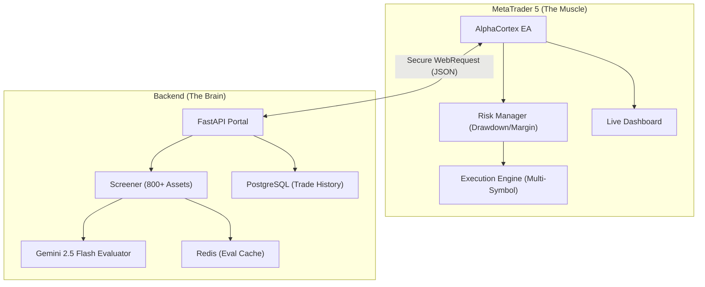

# 🧠 AlphaCortex: Hybrid AI-Quantitative Portfolio Manager

[](https://fastapi.tiangolo.com/)
[](https://www.mql5.com/)
[](https://ai.google.dev/)
[](https://www.docker.com/)

**AlphaCortex** is a professional-grade hybrid trading system that combines the lightning-fast execution and risk management of **MetaTrader 5 (MQL5)** with the advanced reasoning capabilities of **Google Gemini AI**.

It operates as an autonomous fund manager, screening hundreds of assets and building a diversified portfolio based on a strict **Trend-Following** mandate.

---

## 🚀 Key Features

*   **Hybrid Architecture**: Decisions are made by a high-level LLM (Brain), while execution and safety are handled by a low-level EA (Muscle).
*   **Multi-Symbol Management**: Controls a portfolio of 10+ assets (Stocks, Indices, ETFs) from a single MetaTrader chart.
*   **Advanced Risk Guard**: Real-time margin monitoring, per-asset exposure limits, and an automated global Daily Drawdown halt.
*   **AI-Driven Sentiment & Technicals**: Uses Gemini 2.5 Flash to blend technical indicators (RSI, Momentum, Volatility) into actionable portfolio weights.
*   **Trend-Following Mandate**: Programmed to "buy strength and sell weakness," avoiding dangerous mean-reversion traps.

---

## 🏗️ Architecture



---

## 🛠️ Quick Start

### 1. Backend Setup (Docker)

Ensure you have [Docker Desktop](https://www.docker.com/products/docker-desktop/) installed.

```bash
# Clone the repository
git clone https://github.com/youruser/alphacortex.git
cd alphacortex/backend

# Create environment file
cp .env.example .env
# Edit .env and add your GEMINI_API_KEY and a secure API_KEY for the EA
```

Launch the stack:
```bash
docker-compose up -d --build
```

The backend will be live at `http://localhost:8000`. You can explore the API at `http://localhost:8000/docs`.

### 2. EA Installation (MQL5)

1.  Copy the `ea/AI_Fund_Manager.mq5` file into your MetaTrader 5 `MQL5/Experts/` folder.
2.  Open MetaTrader 5, go to **Tools > Options > Expert Advisors**.
3.  Check **"Allow WebRequest for listed URL"** and add: `http://127.0.0.1:8000`.
4.  Compile the EA (`F7` in MetaEditor).
5.  Drag the EA onto a single chart (e.g., NVDA or SPY).
6.  Configure the inputs:
    *   `InpBackendUrl`: `http://127.0.0.1:8000`
    *   `InpApiKey`: Your secure API key from `.env`.

---

## 📈 Dashboard Overview

The AlphaCortex Dashboard provides real-time insights into your fund's performance:
*   **Market Regime**: Detected by AI (BULL, BEAR, CAUTIOUS).
*   **Portfolio Weights**: Ideal weight vs. actual margin usage.
*   **Status**: Live polling updates and countdown to next AI review.
*   **Protection**: Real-time Daily Drawdown monitoring.

---

## ⚖️ Disclaimer

*AlphaCortex is for educational and personal use only. Trading involves significant risk. The authors are not responsible for financial losses. Always test in a demo account before going live.*

---

**Developed with ❤️ by Javier Sobrino Vega**
